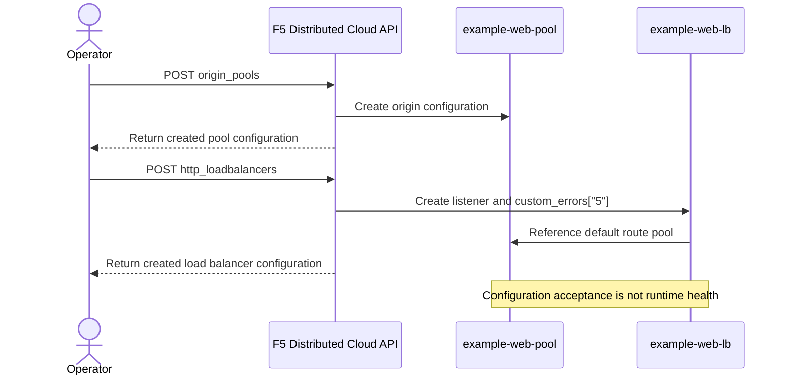

# Configure custom 5xx error responses through the API

## Prerequisites

**Estimated time:** 20–30 minutes, excluding domain validation, certificate provisioning, and preparation of your lab origin.

You configure a dedicated F5 Distributed Cloud Hypertext Transfer Protocol (HTTP) load balancer (LB) through its application programming interface (API). You supply one static HTML (Hypertext Markup Language) body for class `5` (`500–599`), with a request identifier (ID) for support correlation.
You generate JavaScript Object Notation (JSON) request bodies locally with jq.

- Obtain approved API access to an existing lab namespace with permission to create, read, and delete origin pools and HTTP load balancers.
- Confirm that your tenant entitlement supports the required load balancer and automatic certificate features.
- Install Bash, cURL, and jq 1.6 or later locally.
- Supply your API token through an approved secret manager or environment. Do not enable shell tracing or include credentials in files.
- Prepare an owned, reachable public origin serving unencrypted HTTP on port `8080`. Use this only in an isolated, authorized lab; choose encrypted origin transport separately for production requirements.
- Obtain an owned domain with authority to configure its Domain Name System (DNS) records. Arrange automatic Transport Layer Security (TLS) certificate validation for HTTP Secure (HTTPS) and public service DNS before traffic verification.
- Reserve unused resource names in your namespace. Stop if either name already exists; do not overwrite shared resources.

**Examples only — no deployment was executed to produce this guide.** `example.com` is reserved for documentation, not an owned test endpoint. `198.51.100.10` is a TEST-NET-2 documentation address, not a reachable origin. Replace both with your authorized lab targets before making any network request. The guard below blocks unchanged documentation targets, including API calls.

Use a dedicated Bash shell and a private working directory for the commands. The shell stops on errors. Keep response files private because server-added configuration can contain identifying information.

For the response taxonomy and other mechanisms, start with [Custom responses](CUSTOM-RESPONSES.md).


## Understand the minimal design

You create the origin pool before the load balancer that references it. You attach the error body to the load balancer, not to the origin pool or a host-specific route.

| Component | Synthetic example | Purpose |
| --- | --- | --- |
| Namespace | `demo-app` | Existing authorized resource scope |
| Application domain | `example.com` | One application hostname |
| Origin pool | `example-web-pool` | One origin on HTTP port `8080` |
| Origin address | `198.51.100.10` | Documentation-only public origin |
| HTTP load balancer | `example-web-lb` | HTTPS, public default virtual Internet Protocol (IP) address (VIP), default pool reference |
| Error source file | `custom-response-5xx.html` | Generic server-error body |
| Error mapping | `spec.more_option.custom_errors["5"]` | Inline Base64-encoded body for class `500–599` |

Use the same application prefix with role suffixes `-pool` and `-lb`. Both names satisfy the resource naming rules without encoding temporary failure conditions in infrastructure names.



The body applies to matching error responses across the **entire load balancer**. This guide keeps one domain and one default pool, so no additional host route is needed. You omit healthchecks, deliberate broken origins, cache overrides, unrelated security settings, JavaScript, and client-side probes. Omitting a healthcheck does not establish origin health.

| Mapping | Documented scope | Suitable heading |
| --- | --- | --- |
| `"503"` | Exact status `503` | `Service unavailable` |
| `"5"` | Class `500–599`, including `500`, `502`, `503`, and `504` | `Service temporarily unavailable` |
| Exact code plus class | Exact code takes precedence over the matching class | A status-specific exact body with a generic class fallback |

For the inline Base64 format, each map value is limited to **65,536 characters**, including the 10-character `string:///` prefix. Standard padded Base64 therefore allows at most **49,143 decoded HTML bytes**. The pinned support procedure's “0–48 kB” is an approximate description, not a precise byte limit; 48 KiB (49,152 bytes) exceeds this URI-value constraint. A separate API-validation experiment on **2026-10-02** accepted 49,143 bytes and rejected 49,144 bytes; it did not execute this deployment guide or prove runtime rendering. See the [constraint finding](https://github.com/f5-sales-demo/api-specs-enriched/issues/1854).

The `{{request_id}}` placeholder supplies the request identifier. Class `5` selects matching `500–599` responses; it does not change the HTTP status or prove its cause. Do not assume every origin-generated `5xx` body is replaced. Distinguish origin responses from errors generated at the edge, and verify the actual response path in your lab.

This generic static template follows **You Aren't Gonna Need It (YAGNI)**. Define parameters and request handling once to follow **Don't Repeat Yourself (DRY)**. The heading names no fixed status or detailed cause. This guide configures only class `5`; an exact-code mapping added later takes precedence over the matching class.

## Define the parameters

You establish one source of values for every later command.

1. Configure the environment in your dedicated Bash shell.

```bash
set -euo pipefail
umask 077

# Supply XCSH_API_TOKEN securely outside this example.
export XCSH_API_URL='<XC_API_URL>'
export NS='demo-app'
export LB='example-web-lb'
export POOL='example-web-pool'
export DOMAIN='example.com'
export ORIGIN_IP='198.51.100.10'
```

`XCSH_API_URL` is your approved tenant API base URL, starting with `https://` and without a trailing slash. `XCSH_API_TOKEN` is your API token. Replace `<XC_API_URL>` with that base URL; do not infer it from a tenant name. Change `NS` if your authorized existing namespace differs. Replace `DOMAIN` and `ORIGIN_IP` with owned lab values.

2. Define the safety guard.

```bash
require_lab_targets() {
  : "${XCSH_API_TOKEN:?Supply the API token securely}"
  : "${XCSH_API_URL:?Set the approved API base URL}"
  : "${DOMAIN:?Set the owned application domain}"
  : "${ORIGIN_IP:?Set the owned public origin address}"
  case "$XCSH_API_URL $DOMAIN $ORIGIN_IP" in
    *'<'*|*'>'*) printf '%s\n' 'Replace all placeholders first.' >&2; return 1 ;;
  esac
  case "$XCSH_API_URL" in
    https://*/*) printf '%s\n' 'Use the API base URL without a path or trailing slash.' >&2; return 1 ;;
    https://*) ;;
    *) printf '%s\n' 'Use the approved HTTPS API base URL.' >&2; return 1 ;;
  esac
  case "$DOMAIN" in
    example.com|*.example.com|example.net|*.example.net|example.org|*.example.org)
      printf '%s\n' 'Use an owned lab domain, not a reserved example domain.' >&2
      return 1 ;;
  esac
  case "$ORIGIN_IP" in
    192.0.2.*|198.51.100.*|203.0.113.*)
      printf '%s\n' 'Use an owned origin, not a TEST-NET address.' >&2
      return 1 ;;
  esac
}
```

The guard rejects these documentation defaults; it does not establish ownership or authorization. Review the effective tenant, namespace, domain, and origin yourself before proceeding.

3. Define the authenticated request helper.

```bash
api_request() {
  require_lab_targets || return 1
  local method="$1" path="$2" output="$3" body="${4-}"
  set -- \
    --fail \
    --silent \
    --show-error \
    --request "$method" \
    --header "Authorization: APIToken $XCSH_API_TOKEN" \
    --header 'Content-Type: application/json' \
    --output "$output" \
    "$XCSH_API_URL$path"
  if [ -n "$body" ]; then
    set -- "$@" --data-binary "@$body"
  fi
  curl "$@"
}
```

Run each mutation once. Stop on a transport or API error; do not retry a creation blindly. Never send the API token to your application domain. These direct API request bodies use `{metadata, spec}`, not manifest `{kind, metadata, spec}` wrappers.

## Prepare the error body

You create a small, self-contained source file without scripts, remote assets, or inferred health labels.

1. Save this HTML as `custom-response-5xx.html` in your private working directory.

```html
<!doctype html>
<html lang="en">
<head>
  <meta charset="utf-8">
  <meta name="viewport" content="width=device-width, initial-scale=1">
  <title>Service temporarily unavailable</title>
</head>
<body>
  <main>
    <h1>Service temporarily unavailable</h1>
    <p>Please try again later.</p>
    <p>Support ID: <code>{{request_id}}</code></p>
  </main>
</body>
</html>
```

2. Measure the source body.

```bash
bytes=$(wc -c < custom-response-5xx.html)
[ "$bytes" -le 49143 ] || { printf '%s\n' 'HTML exceeds 49,143 bytes.' >&2; exit 1; }
printf 'HTML bytes: %s\n' "$bytes"
```

Keep this small template well below the decoded-byte maximum. The byte count depends on the exact file content and line endings; no measured count for this template is asserted here.

3. Encode the source as one JSON string.

```bash
jq -Rs '"string:///" + @base64' custom-response-5xx.html > custom-response-5xx.value.json
jq -e 'type == "string" and startswith("string:///") and length <= 65536' \
  custom-response-5xx.value.json
```

`string:///` is the literal inline-content prefix outside the encoded bytes. Encode the HTML once; do not encode the prefix or double-encode an existing Base64 payload. Expect `true` with exit status `0` from the URI-value check before generating the load balancer request.

4. Check the encoding round trip.

```bash
jq -j 'ltrimstr("string:///") | @base64d' \
  custom-response-5xx.value.json > custom-response-5xx.roundtrip.html
cmp custom-response-5xx.html custom-response-5xx.roundtrip.html
```

Expect no `cmp` output with exit status `0`. This checks local encoding only, not API acceptance or request-identifier substitution.

## Create the origin pool

You describe the origin once with a public address, port `8080`, and explicit unencrypted transport.

1. Generate the pool request body.

```bash
jq -n \
  --arg name "$POOL" \
  --arg namespace "$NS" \
  --arg ip "$ORIGIN_IP" \
  '{metadata: {name: $name, namespace: $namespace},
    spec: {origin_servers: [{public_ip: {ip: $ip}}],
           port: 8080, no_tls: {}}}' > pool.create.json
```

2. Create the pool in the authorized namespace.

```bash
api_request POST \
  "/api/config/namespaces/$NS/origin_pools" \
  pool.create.response.json \
  pool.create.json
```

3. Check the returned identity.

```bash
jq -e \
  --arg name "$POOL" \
  --arg namespace "$NS" \
  '.metadata.name == $name and .metadata.namespace == $namespace' \
  pool.create.response.json
```

Expect `true` with exit status `0`. The successful create response confirms accepted configuration, not reachability or runtime health.

## Create the load balancer

You configure automatic HTTPS certificates, public default VIP advertising, one default pool reference, and the class `5` error mapping.

1. Generate the load balancer request body.

```bash
jq -n \
  --arg name "$LB" \
  --arg namespace "$NS" \
  --arg domain "$DOMAIN" \
  --arg pool "$POOL" \
  --slurpfile error custom-response-5xx.value.json \
  '{metadata: {name: $name, namespace: $namespace},
    spec: {domains: [$domain],
           https_auto_cert: {},
           advertise_on_public_default_vip: {},
           default_route_pools: [
             {pool: {name: $pool, namespace: $namespace},
              weight: 1, priority: 1}],
           more_option: {custom_errors: {"5": $error[0]}}}}' \
  > lb.create.json
```

The empty `https_auto_cert` object selects automatic certificates. You omit optional TLS, header, redirect, and mutual-TLS settings rather than restating server defaults. The empty advertising object selects the **public default VIP**, not a separately assigned public VIP. The pool reference uses the same namespace, with weight and priority `1`.

2. Inspect the generated configuration without printing the encoded body.

```bash
jq '{metadata, domains: .spec.domains,
     default_route_pools: .spec.default_route_pools,
     error_codes: (.spec.more_option.custom_errors | keys)}' lb.create.json
```

Synthetic illustrative output with the documentation defaults — **not a measured deployment response**:

```json
{
  "metadata": {"name": "example-web-lb", "namespace": "demo-app"},
  "domains": ["example.com"],
  "default_route_pools": [
    {"pool": {"name": "example-web-pool", "namespace": "demo-app"},
     "weight": 1, "priority": 1}
  ],
  "error_codes": ["5"]
}
```

3. Create the dedicated load balancer.

```bash
api_request POST \
  "/api/config/namespaces/$NS/http_loadbalancers" \
  lb.create.response.json \
  lb.create.json
```

4. Check the returned identity and error body.

```bash
jq -e \
  --arg name "$LB" \
  --arg namespace "$NS" \
  --slurpfile error custom-response-5xx.value.json \
  '.metadata.name == $name and .metadata.namespace == $namespace and
   .spec.more_option.custom_errors["5"] == $error[0]' \
  lb.create.response.json
```

Expect `true` with exit status `0`. This verifies accepted configuration only. Complete the required domain-validation records and public service DNS through your authorized DNS process. Wait for automatic certificate provisioning before testing HTTPS; do not bypass certificate verification with `--insecure`.

For an existing shared load balancer, do not submit this minimal body with `PUT`: that operation replaces configuration. Obtain a fresh named `GET`, preserve the full current spec and allowed metadata, review all affected domains and dependencies, then change only the intended mapping under an authorized change window. This guide does not provide a second, duplicate configuration flow.

## References

You can review the exact contracts behind these examples:

- [Origin pool operations and minimum fields](xcsh://api-catalog/?resource=origin_pool&compact=true).
- [Origin endpoint schema](xcsh://api-spec/virtual?resource=origin_pool&field=spec.origin_servers).
- [HTTP load balancer operations and minimum fields](xcsh://api-catalog/?resource=http_loadbalancer&compact=true).
- [Automatic HTTPS certificate field](xcsh://api-spec/virtual?resource=http_loadbalancer&field=spec.https_auto_cert).
- [Custom error mapping field](xcsh://api-spec/virtual?resource=http_loadbalancer&field=spec.more_option.custom_errors).
- [Custom error procedure, class scope, precedence, approximate body limit, and request identifier](xcsh://documentation/my-f5-com/K000147771/index.md#procedure).
- [Precise map-value constraint and API boundary-test finding](https://github.com/f5-sales-demo/api-specs-enriched/issues/1854).
- [Automatic certificate generation prerequisites](xcsh://documentation/docs-cloud-f5-com/platform/concepts/load-balancing-and-mesh/index.md#automatic-certificate-generation).
- [HTTP load balancer certificate and DNS guidance](xcsh://documentation/docs-cloud-f5-com/multi-cloud-app-connect/how-to/load-balance/create-http-load-balancer/index.md#objective).
- [Human-facing API documentation](https://f5-sales-demo.github.io/api-specs-enriched/en/).
- [Documentation style guide](https://github.com/f5-sales-demo/docs-control/blob/main/STYLE_GUIDE.md).

Product procedure references use pinned snapshot `content-20260928T200055Z`. The cited console procedure establishes error-response semantics; all resource operations here use the API.

## Verify

You distinguish configuration acceptance from observable traffic behavior. No live results are claimed by this guide.

1. Prepare approved, controlled lab cases for applicable `500`, `502`, `503`, and `504` responses at this load balancer.

Use your lab's approved fault scenarios, one case at a time. Record the expected status and whether the response originates at the origin or the edge. Do not break a shared origin, add a timeout healthcheck solely for this page, or assume a deliberately returned origin `5xx` body is necessarily replaced. If a case cannot be produced safely or does not exercise the custom-error response path, record that limitation; do not claim runtime coverage for it.

2. Capture the application response without an API token for each approved case.

```bash
require_lab_targets
curl \
  --silent \
  --show-error \
  --max-time 20 \
  --dump-header public.headers.txt \
  --output public.body.html \
  --write-out 'HTTP status: %{http_code}\n' \
  "https://$DOMAIN/"
```

Do not use `--fail` for this request: an error status is the intended test response and you need its body. Do not use a browser display override as a substitute for the measured HTTP status. Repeat this capture and the body check below for each case, recording results before the next capture overwrites the files.

Compare the measured status with the expected status of the active case:

| Approved case | Expected cURL output |
| --- | --- |
| Applicable `500` | `HTTP status: 500` |
| Applicable `502` | `HTTP status: 502` |
| Applicable `503` | `HTTP status: 503` |
| Applicable `504` | `HTTP status: 504` |

These are test expectations, not observed results. The generic page changes the response body, not the status code.

3. Check the body and request identifier.

```bash
jq -Rrs -e '
  contains("<h1>Service temporarily unavailable</h1>") and
  (contains("{{request_id}}") | not) and
  test("Support ID: <code>[^<]+</code>")
' public.body.html
```

For each applicable custom-error case, expect `true` with exit status `0`, an HTML content type in `public.headers.txt`, and a populated request identifier in the body. Correlate that identifier with the corresponding authorized request record; absence of the literal placeholder alone does not prove correct correlation. Record status, body-check result, and origin-versus-edge response path for each case. Keep identifiers private.

4. Restore the normal lab condition.

5. Capture a normal application request using the same public-request command.

Expect your application's normal status and body, not this error page. Record the actual result. Successful tests prove only the tested response paths; even passing `500`, `502`, `503`, and `504` cases does not prove all `500–599` responses are replaced, origin health, or application resilience.

## Clean up

You remove only the dedicated resources created by this walkthrough, in reverse dependency order. Confirm that no other resource uses this pool before deleting it. If creation failed, delete only objects whose creation you confirmed; do not remove pre-existing objects with matching names.

1. Delete the dedicated load balancer.

```bash
api_request DELETE \
  "/api/config/namespaces/$NS/http_loadbalancers/$LB" \
  lb.delete.response.json
```

2. Delete the dedicated origin pool after the load balancer deletion succeeds.

```bash
api_request DELETE \
  "/api/config/namespaces/$NS/origin_pools/$POOL" \
  pool.delete.response.json
```

Expect successful API status and an empty JSON object (`{}`) for each standard deletion. Stop on an error rather than continuing to dependent deletion.

3. Remove only the lab DNS records you added for this walkthrough through your authorized DNS process.

4. Remove the local generated files through your approved retention process.

Keep only source HTML you intend to maintain. Delete private response captures and generated payloads when no longer required. This teardown does not create or delete a namespace, change shared resources, or execute automatically.

