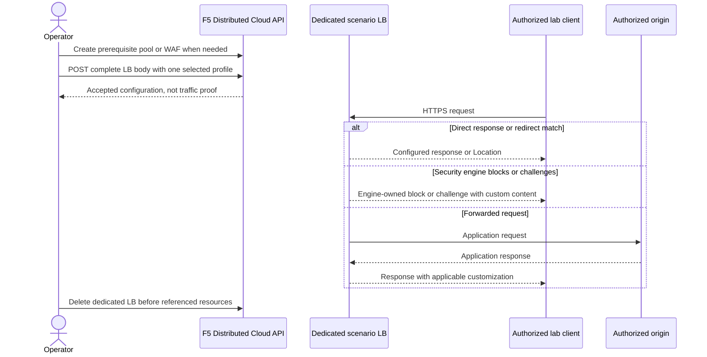

# Showcase custom responses in F5 Distributed Cloud

## Prerequisites

**Estimated time:** 10 minutes to choose scenarios; 20–40 minutes per isolated lab scenario, excluding entitlement activation, domain validation, certificate provisioning, and origin preparation.

You distinguish response-body replacement, direct responses, security blocking, challenge messages, redirects, and response-header customization. This is a **bounded coverage audit of documented Hypertext Transfer Protocol (HTTP) load balancer response mechanisms**, not a promise of every capability across every F5 Distributed Cloud product, connector, contract tier, or response path.

- Obtain authorized application programming interface (API) access to an existing lab namespace.
- Confirm entitlement and role requirements for each selected feature; access to a load balancer does not establish access to Bot Defense or other add-ons.
- Install Bash, cURL, and jq 1.6 or later for the implementation guides.
- Prepare owned test domains, Domain Name System (DNS) records, Transport Layer Security (TLS) certificates, and a reachable authorized origin.
- Use synthetic data and dedicated resources, not shared applications.

**Examples only.** No infrastructure, traffic, or GitHub changes were executed for this showcase. `example.com` and `198.51.100.10` are documentation targets. Replace them with owned lab targets before network requests; the shared guard blocks unchanged documentation targets. API acceptance and runtime behavior are separate evidence.

## Choose the response owner

HTTP response customization requires a completed HTTP request path. These mechanisms do not produce an HTTP page for a TLS handshake failure before HTTP exists. HTTP Secure (HTTPS) protects transport; it does not make every error customizable. Custom-body fields below use a Uniform Resource Identifier (URI); HTML means Hypertext Markup Language, and JSON means JavaScript Object Notation.

| Trigger | Response owner and exact API field | Customizable result | Example and scope |
| --- | --- | --- | --- |
| Applicable response in `300–599` | HTTP load balancer (LB): `spec.more_option.custom_errors` | Body by exact status or class `3`, `4`, `5`; does not select a new status | Generic `5xx`, branded `404`, exact `503` with class fallback; [5xx guide](CUSTOM-RESPONSE-5XX.md) and [mapping variants](CUSTOM-RESPONSE-SCENARIOS.md#configure-other-error-mappings) |
| Request matches a direct route | LB: `spec.routes[].direct_response_route.route_direct_response` | Integer `response_code` and inline `response_body_encoded` | Planned `503` maintenance, `200` static acknowledgement; [direct responses](CUSTOM-RESPONSE-SCENARIOS.md#configure-a-direct-response) |
| Web application firewall (WAF) blocks a request | Application firewall: `spec.blocking_page` | Status enum `response_code` and URI-valued `blocking_page`; HTML or JSON content is described | Branded denial for an authorized Structured Query Language injection (SQLi) demonstration; [WAF response](CUSTOM-RESPONSE-SCENARIOS.md#configure-a-waf-blocking-response) |
| Browser must complete a JavaScript (JS) challenge | LB: `spec.js_challenge.custom_page` | Custom message, delay, challenge-cookie lifetime | Brief waiting message, not a hand-written replacement challenge; [JS challenge](CUSTOM-RESPONSE-SCENARIOS.md#configure-challenge-messages) |
| Browser must complete a Completely Automated Public Turing test to tell Computers and Humans Apart (CAPTCHA) challenge | LB: `spec.captcha_challenge.custom_page` | Custom message and challenge-cookie lifetime | Verification instruction with the platform CAPTCHA retained; [CAPTCHA challenge](CUSTOM-RESPONSE-SCENARIOS.md#configure-challenge-messages) |
| Policy selects a challenge | LB: `spec.policy_based_challenge.js_challenge_parameters.custom_page` or `captcha_challenge_parameters.custom_page` | Same message concept; rule-controlled trigger | Confirmed API fields; not a separate page generator or a second runnable policy walkthrough |
| Layer 7 distributed denial-of-service (DDoS) mitigation selects JS challenge | LB: `spec.l7_ddos_action_js_challenge.custom_page` | Message, delay, cookie lifetime | Confirmed conditional mitigation message; [DDoS extension](CUSTOM-RESPONSE-SCENARIOS.md#extend-challenge-message-coverage); no flood is needed or supplied |
| Bot Defense Standard mitigates a protected endpoint | LB: `spec.bot_defense.policy.protected_app_endpoints[].mitigation.block.body` and `.status` | Custom blocking body and status; `.mitigation.redirect.uri` selects a destination | Additional confirmed mechanism; [bounded Bot Defense implementation](CUSTOM-RESPONSE-SCENARIOS.md#bound-bot-defense-customization) |
| Request matches a redirect route | LB: `spec.routes[].redirect_route.route_redirect` | Redirect status, protocol, host, path and query handling | Canonical path migration; [redirect scenario](CUSTOM-RESPONSE-SCENARIOS.md#configure-a-redirect); target supplies any destination page |
| Response travels downstream | LB: `spec.more_option.response_headers_to_add`, `response_headers_to_remove`, `response_cookies_to_add`, `response_cookies_to_remove` | Header and cookie metadata | Diagnostic marker or cookie policy; [metadata scenario](CUSTOM-RESPONSE-SCENARIOS.md#configure-response-metadata); not a page generator |
| Response contains selected sensitive fields | LB: `spec.sensitive_data_disclosure_rules` or `data_guard_rules` | Masking selected content | Response transformation, not an arbitrary custom page; separate security policy and validation required |

Exact-status mapping takes precedence over the matching class. Do not infer that `custom_errors["4"]` overrides WAF, Bot Defense, service-policy, or rate-limit responses: each engine owns its response path. Do not infer that every origin-generated error body is replaced. Prove the actual path with controlled tests.

This diagram is a taxonomy, **not a verified evaluation-order or precedence specification**. Separate profiles avoid inventing a precedence relationship between engines.

## Keep limits feature-specific

Uniform inline encoding does not imply uniform limits or identical rendering contracts. A Uniform Resource Identifier (URI) value starts with `string:///`, followed by standard padded Base64-encoded content. JavaScript Object Notation (JSON) escaping is handled by jq, not manual concatenation.

| Field family | Confirmed constraint | Safe implementation policy |
| --- | --- | --- |
| `more_option.custom_errors` map values | 65,536 URI characters; the existing guide cites the separate API boundary experiment | Follow the canonical [5xx limit and encoding procedure](CUSTOM-RESPONSE-5XX.md#understand-the-minimal-design); request ID substitution is documented here |
| Direct `response_body_encoded` | `maxLength: 65536`, URI; catalog explicitly describes `string:///` Base64 plain text or HTML | Check the complete URI length independently; do not claim a live-tested maximum or request ID substitution |
| JS/CAPTCHA `custom_page`, including policy and DDoS variants | Each inspected leaf has `maxLength: 65536`, URI; only `string:///` is described | Keep a short message; preserve the challenge engine, scripts and interaction |
| WAF `blocking_page.blocking_page` | Schema has `maxLength: 4096`, URI; support guidance says 4,096 bytes applies to Base64-encoded content, not source text | Conservatively check both encoded content and complete URI against 4,096; do not reuse the 5xx maximum |
| Bot Defense Standard block `.body` | `maxLength: 4096`, URI; catalog describes Base64 content | Check this field independently; no live boundary test or request ID substitution is claimed |
| Response headers/cookies | Up to 32 entries per inspected LB add/remove list; add-value strings up to 8,096 characters | Use short synthetic metadata; do not apply body-size rules to headers |

The WAF guide describes JSON bodies, but this audit did not establish a per-WAF content-type field. Do not present JSON text as a verified `application/json` response. General Bot Defense planning documentation mentions content-type customization; the inspected native Standard block schema exposes body and status, not a verified `content_type` leaf. Do not borrow connector fields into this API.

## Record coverage boundaries

| Inspected area | What is established | What is not claimed |
| --- | --- | --- |
| Generic errors | Classes `3`, `4`, `5`, exact `300–599`, documented request ID placeholder | Every origin error or security-engine reply is rewritten |
| Service policy | Native allow/deny decisions are present; no dedicated custom response-body field was found in the inspected service-policy contract | A service-policy deny can use the WAF blocking-page field or always uses a particular generic mapping |
| API rate limiting | Native endpoint/base-path limit rules are present | A dedicated arbitrary custom-body field; a `429` mapping always replaces rate-limit output |
| Bot Defense Standard | Custom block body/status and mitigation redirect are confirmed | Runnable fresh activation in an arbitrary tenant; schema's status constraint has contradictory enum/length evidence (see scenarios) |
| Bot Defense Advanced | Separate `.bot_defense_advanced.web` and `.mobile` references exist | Standard endpoint fields can be applied directly to Advanced references or all external connectors |
| Policy/DDoS challenges | Custom-message leaves are confirmed; documentation describes conditional challenges | Guaranteed activation from a normal request or an arbitrary HTML replacement of the challenge |
| Sensitive-data masking, JS injection, cookie protection | Response transformations exist in the inspected LB schema and configuration guidance | They are arbitrary page generators or belong to this runnable showcase |
| Other products and non-HTTP protocols | Outside the audited HTTP LB/app-firewall contracts | Exhaustive product-wide coverage, raw TCP/UDP pages, or pre-HTTP TLS error pages |

A missing field in this audit is a **coverage limitation**, not proof the product can never support that outcome. Any later extension needs its own exact API schema, documentation trail, entitlement check and runtime validation.

## Follow the implementation guides

- Use [Custom 5xx responses](CUSTOM-RESPONSE-5XX.md) for canonical authentication, target guards, pool creation, inline encoding, precise 5xx finding and fault-path verification.
- Use [Custom response scenarios](CUSTOM-RESPONSE-SCENARIOS.md) for direct responses, WAF blocking, challenge messages, redirects and response metadata. It references the shared setup rather than duplicating credentials or pool definitions.
- Reserve semantic names such as `example-response-maintenance-lb`, `example-response-static-lb`, `example-response-waf-lb`, `example-response-js-lb`, `example-response-captcha-lb`, `example-response-redirect-lb`, `example-response-metadata-lb`, and `example-response-pool`.

Use one dedicated LB/profile at a time for a given hostname, or assign distinct owned hostnames. Never publish the same hostname on competing scenario LBs. Maintain one generated create body per object; do not maintain a parallel console configuration.

## Sources

Evidence uses pinned snapshot `content-20260928T200055Z` and the embedded API catalog/specification. No live fallback was needed.

- [Custom error procedure](xcsh://documentation/my-f5-com/K000147771/index.md#procedure).
- [Route direct response and redirect concepts](xcsh://documentation/docs-cloud-f5-com/multi-cloud-app-connect/how-tos/advanced-app-nwg/virtual-hosts/index.md#create-route) — use the current embedded LB fields, not legacy route-object examples.
- [WAF creation and blocking page](xcsh://documentation/docs-cloud-f5-com/web-app-and-api-protection/how-to/app-security/application-firewall/index.md#create-a-waf).
- [WAF Base64 limit](xcsh://documentation/my-f5-com/K000162105/index.md#description).
- [Custom JS challenge message](xcsh://documentation/docs-cloud-f5-com/multi-cloud-app-connect/how-to/adv-security/js-challenge/index.md#prepare-custom-page-for-redirection).
- [LB challenges, DDoS, headers and masking](xcsh://documentation/docs-cloud-f5-com/multi-cloud-app-connect/how-to/load-balance/create-http-load-balancer/index.md#configuration).
- [Bot mitigation actions](xcsh://documentation/docs-cloud-f5-com/bot-defense/how-tos/plan-bot-defense/index.md#configure-mitigation-actions).
- [Bot Standard prerequisites and mitigation](xcsh://documentation/docs-cloud-f5-com/bot-defense/quickstarts/bot-defense-waap/index.md#step-4-configure-mitigation-actions).
- [HTTP LB catalog and complete field descriptions](xcsh://api-catalog/http-loadbalancers).
- [HTTP LB compact create contract](xcsh://api-catalog/?resource=http_loadbalancer&compact=true).
- [Application firewall create contract](xcsh://api-catalog/?resource=app_firewall&compact=true).
- [Service-policy contract](xcsh://api-catalog/?resource=service_policy&compact=true).
- [HTTP LB schema](xcsh://api-spec/virtual?resource=http_loadbalancer) and [application firewall schema](xcsh://api-spec/virtual?resource=app_firewall).
- [Documentation style guide](https://github.com/f5-sales-demo/docs-control/blob/main/STYLE_GUIDE.md).

## Verify

Before presenting a scenario, record accepted configuration, entitlement, status, content type, body/message, trigger owner and the negative control. Prove challenge completion separately from visible wording. Correlate request IDs only where the mechanism's substitution contract is established. A correct static `200` acknowledgement is not an origin-health probe.

The local documentation checks validate shell syntax, JSON/jq construction, encoding, links and synthetic examples. They do not establish live API acceptance, certificate issuance, WAF detection, challenge completion or runtime page rendering. Follow the per-scenario positive/negative verification matrix before claiming those outcomes.

## Clean up

Delete only confirmed dedicated scenario LBs before their WAF/pool prerequisites. Remove only DNS records and private captures created for your lab. Preserve shared resources and stop dependent deletion after an API error. Use the [scenario cleanup procedure](CUSTOM-RESPONSE-SCENARIOS.md#clean-up) or the [5xx teardown](CUSTOM-RESPONSE-5XX.md#clean-up), not both against the same resources.
